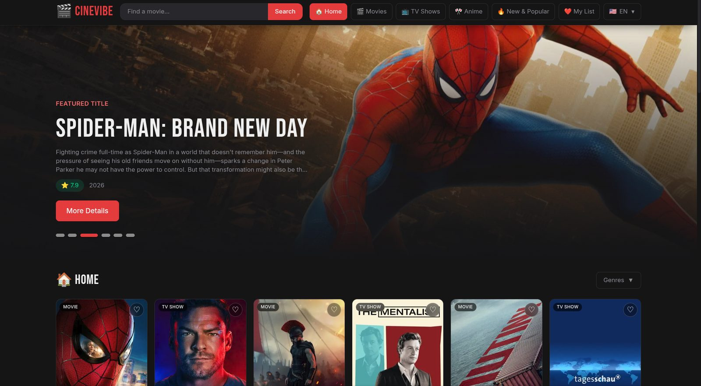
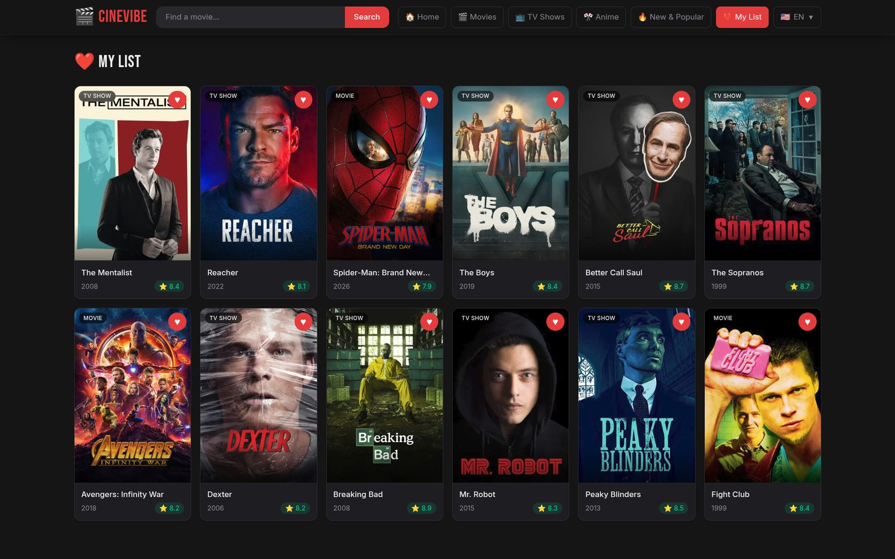
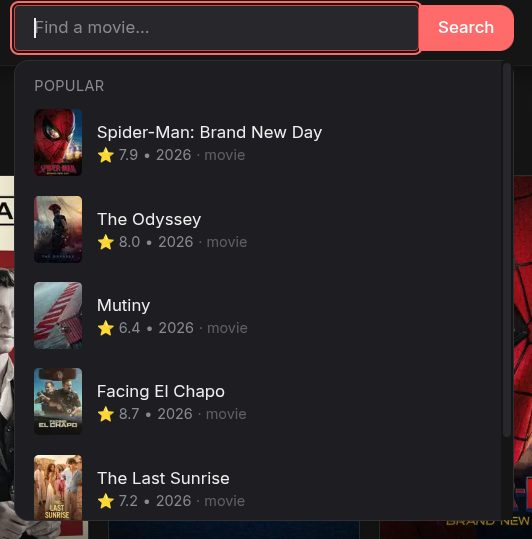
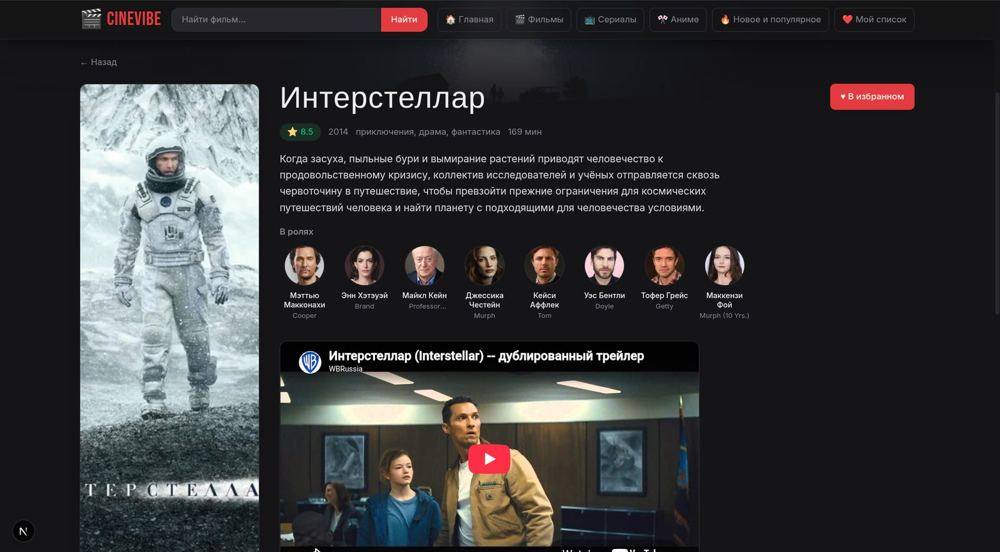
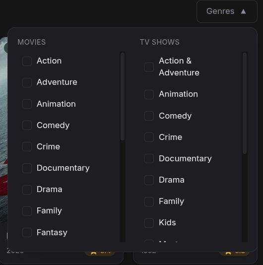

# CineVibe (Next.js + Tailwind)


**🔗 Живая демка: [cinevibe2.vercel.app](https://cinevibe2.vercel.app)**

Витрина фильмов и сериалов на данных [TMDB](https://www.themoviedb.org/). Переписано с оригинального
vanilla-JS прототипа на **Next.js 16 (App Router)** и **Tailwind CSS v4**.

## Что внутри

- **Главная** — популярные фильмы и сериалы вперемешку, hero-баннер с автопрокруткой
- **Фильмы / Сериалы / Аниме / Новое и популярное** — отдельные разделы с фильтром по жанрам
- **Поиск** с живыми подсказками по мере ввода
- **Страница фильма/сериала** — постер, описание, актёры, трейлер на YouTube, похожие тайтлы
  (вместо модалки в оригинале — отдельный URL `/title/movie/123`, что дружелюбнее для шеринга и SEO)
- **Избранное** — хранится в `localStorage`, синхронизируется через React Context
- Полностью серверный рендеринг списков (Server Components) — TMDB API ключ никогда не попадает в браузер
- **SEO**: метаданные и Open Graph / Twitter card на каждой странице (включая динамические превью для
  карточек фильмов при шеринге), `robots.txt`, `sitemap.xml`
- **Тесты**: unit-тесты на бизнес-логику (Vitest) и e2e на ключевые пользовательские сценарии (Playwright)
- **CI**: lint, typecheck, unit-тесты, билд и e2e на каждый push/PR через GitHub Actions

## Скриншоты

|                                    |                                    |
| ---------------------------------- | ---------------------------------- |
| **Главная**  | **Мой список**  |
| **Поиск с подсказками**  | **Страница фильма**  |
| **Фильтр по жанрам**  | |

## Быстрый старт

```bash
npm install
cp .env.example .env.local
```

Впиши свой TMDB API-ключ в `.env.local` (см. раздел ниже), затем:

```bash
npm run dev
```

Откроется на [http://localhost:3000](http://localhost:3000).

### Получение TMDB API-ключа

Ключ обязателен — без него приложение покажет экран с инструкцией вместо каталога.

1. Зарегистрируйся на [themoviedb.org](https://www.themoviedb.org/signup) и получи бесплатный API-ключ
   (Настройки → API → v3 auth key или v4 Read Access Token — оба формата поддерживаются, определяется
   автоматически по формату строки).
2. Впиши его в `.env.local`:
   ```
   TMDB_API_KEY=твой_ключ
   ```
3. Перезапусти `npm run dev`.

## Стек

- Next.js 16 (App Router, Server Components, Route Handlers)
- TypeScript
- Tailwind CSS v4
- `next/image` с CDN-оптимизацией постеров TMDB
- Vitest + Testing Library (unit)
- Playwright (e2e)

## Структура проекта

```
app/
  page.tsx                 — главная
  movies/ tv/ anime/ new/  — секции каталога
  search/                  — результаты поиска
  favorites/               — серверная обёртка (метаданные) + FavoritesView
  title/[type]/[id]/       — страница фильма/сериала (+ generateMetadata для OG-превью)
  robots.ts sitemap.ts     — SEO-файлы
components/                — переиспользуемые UI-компоненты
context/                   — FavoritesContext, ToastContext
lib/
  tmdb.ts                  — серверный TMDB-клиент (ключ не покидает сервер)
  tmdb-client.ts           — клиент-safe хелперы для URL постеров
  queries.ts                — сборка данных по разделам (аналог fetchAndRender из оригинала)
types/tmdb.ts               — типы TMDB-сущностей
e2e/                        — Playwright-тесты пользовательских сценариев
*.test.ts(x)                — unit-тесты рядом с тестируемым файлом
```

## Тестирование

```bash
npm test              # unit-тесты (Vitest), разово
npm run test:watch    # unit-тесты в watch-режиме
npm run test:e2e      # e2e (Playwright) — требует TMDB_API_KEY и собранный проект
npm run test:e2e:ui   # то же самое с интерактивным UI-раннером
npm run typecheck     # tsc --noEmit
npm run lint          # eslint
```

Перед первым запуском e2e установи браузеры Playwright:

```bash
npx playwright install --with-deps chromium
```

**Важно про e2e:** тесты ходят в настоящий TMDB API через собственные серверные запросы приложения
(Server Components выполняются на сервере, поэтому мокать их на уровне браузера, как обычный
`page.route()`, не получится без экспериментальной прокси-интеграции). Поэтому:

- нужен реальный `TMDB_API_KEY` в окружении, где тесты запускаются, включая CI (см. ниже);
- тесты написаны так, чтобы не зависеть от конкретных тайтлов — они проверяют структуру и поведение
  («на странице отображается сетка карточек», «клик по карточке ведёт на страницу тайтла»), а не точные
  названия фильмов, потому что список «популярного» на TMDB меняется со временем.

## CI (GitHub Actions)

Workflow в `.github/workflows/ci.yml` запускает на каждый push/PR в `main`: lint → typecheck → unit-тесты
→ билд → e2e. Для его работы добавь секрет в настройках репозитория:

**Settings → Secrets and variables → Actions → New repository secret**
```
Name:  TMDB_API_KEY
Value: твой_ключ
```

E2E-джоб пропускается для PR из форков без доступа к секретам, чтобы не ломать CI для внешних контрибьюторов.

## Деплой на Vercel

1. Запушь репозиторий на GitHub.
2. Импортируй проект в [Vercel](https://vercel.com/new).
3. В настройках проекта (Environment Variables) добавь:
   - `TMDB_API_KEY` — твой ключ
   - `NEXT_PUBLIC_SITE_URL` — итоговый домен деплоя (например, `https://cinevibe.vercel.app`),
     используется для абсолютных Open Graph/canonical URL и sitemap
4. Deploy — дополнительная конфигурация не нужна, `next.config.ts` уже настроен под Vercel по умолчанию.

## Известные ограничения и что можно улучшить дальше

- Раздел «Аниме» и жанровые фильтры используют эвристики TMDB (`with_origin_country=JP` +
  `with_genres=16`), а не отдельную категорию TMDB — так же, как было в оригинале.
- `TMDB_API_KEY` принимает **оба** формата — plain v3 API key и v4 Read Access Token (JWT) — и
  автоматически выбирает правильный способ передачи (query-параметр `api_key` для v3, заголовок
  `Authorization: Bearer` для v4).
- Шрифты (Bebas Neue, Inter) сейчас подключены через `<link>` на Google Fonts CDN. Миграция на
  `next/font/google` избавила бы от внешнего запроса при загрузке и убрала бы связанное
  предупреждение линтера — не сделано в этой итерации, потому что не удалось проверить билд
  в текущем окружении с ограниченным сетевым доступом; стоит попробовать отдельно.
- `sitemap.ts` включает только сегодняшние популярные тайтлы, а не весь каталог TMDB (это
  сотни тысяч страниц, которыми проект не владеет) — осознанный компромисс, а не недосмотр.

